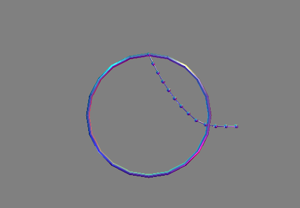

CSCI 520, Assignment 3

Xi Zhang

================

#Description
Constrained Particle System with Baumgarte stabilization

#Preview

#Library Dependence
- glut
- gsl

#Usage
./constrainedParticleSystem.exe [Euler or RK4] [number of particles] [alpha value] [beta value]

#Mouse Interaction
push right button to adjust rotate camera

#Keyboard Interaction
- e: reset camera
- p: pause
- z: zoom in
- x: zoom out
- r: constrain/free the last point a ring
- c: add force on all/last point(s)
- s: print state
- [space]: screen save
- [keyboard cursor]: add force on cursor direction

